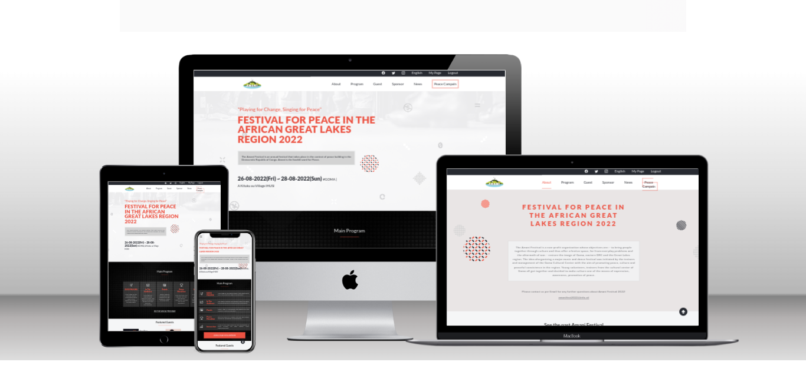

# 


# Project: amani-fest

> Amani-fest is a project to design a platform for Amani Festival which is the annual festival where people get united to sing, dance, and proclaim peace. 
> Take place in February every year in Goma Town/DRCongo. 
> With this platform you will get all information about the Festival, and even book the ticket for the event.

# Screenshot


## Built With

- HTML
- CSS & SCSS
- Bootstrap Icon
- js DOM API

## Getting Started


)

## Prerequisites

### Setup
[-] Clone the repository:

    $ git clone https://github.com/Bateyjosue/amani-fest.git`

[-] Navigate into the project folfer

    $ cd amani-fest

>Note: The Dependencies to be install will be used for linters configuration

[-] Install dependencies of the project using `npm` package manager

    $ npm i || npm install

[-] Run the project 

After the server is runned open your brower and browse to the following address: 

    localhost:5000
> Note: this address is available if you run your project using the **live server** extension in ```vs code```. Please Install **Live Server** to enjoy this feature
### Usage

the project was debug and format using linters html & css [more about linters](https://github.com/microverseinc/curriculum-transversal-skills/blob/main/clean-code/linters.md)

1. ```npm install --save-dev hint@7.x``` then add the configure file ```[ -f .hintrc ] || wget https://raw.githubusercontent.com/microverseinc/linters-config/master/html-css/.hintrc```, then run the diagnosis using ```npx hint .```

2. ```npm install --save-dev stylelint@13.x stylelint-scss@3.x stylelint-config-standard@21.x stylelint-csstree-validator@1.x``` then add the configure file ```[ -f .stylelintrc.json ] || wget https://raw.githubusercontent.com/microverseinc/linters-config/master/html-css/.stylelintrc.json```, then run the diagnosis using ```npx stylelint "**/*.{css, scss}"``` and the, ```npx stylelint "**/*.{css, scss}" --fix``` to fix detected errors

3. ```npm install --save-dev eslint@7.x eslint-config-airbnb-base@14.x eslint-plugin-import@2.x babel-eslint@10.x```, then add configuration file with ``` [ -f .eslintrc.json ] || wget https://raw.githubusercontent.com/microverseinc/linters-config/master/html-css-js/.eslintrc.json```, After you can check for eslint issues with  ```npx eslint .```

> Note: Check out the **live demo | Video Demo** to see how the project works...
### Live Demo
 > [Live demo](https://bateyjosue.github.io/amani-fest/) && [Video demo](https://www.loom.com/share/223e4ec4006549b3a5341fa48c999096)

## Authors

👤 **Author**

- GitHub: [Bateyjosue](https://github.com/Bateyjosue)
- Twitter: [bateyjosue](https://twitter.com/JosueBatey)
- LinkedIn: [bateujosue](https://linkedin.com/in/josue-ishara)
## Acknowledgement
    To : Cindy Shinon Behance for her UI design template

    & Amani Festival for the insparation
    

## 🤝 Contributing

  Contributions, issues, and feature requests are welcome!

  Feel free to check the [issues page](../../issues/).

## Show your support

Give a ⭐️ if you like this project!

## 📝 License

[Josh Batey](/LICENSE) Licensed
